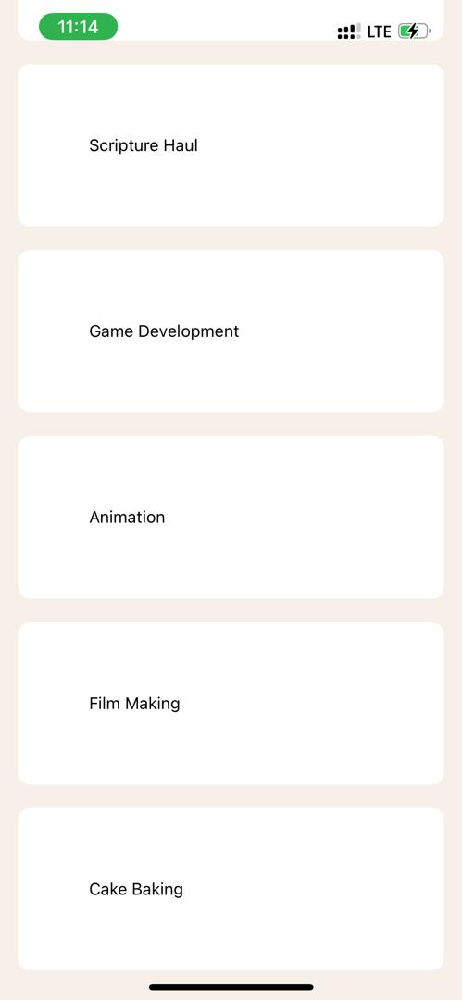

# rn-assignment3-11167338
 ## Description
This is a mobile application developed for the DCIT202 course, demonstrating the use of core React Native components and custom components to create a task management application.

## Components
- **TaskList**:Renders a list of tasks using FlatList.
- **HomeScreen**: Displays task categories and the task list.
- **App**: Main entry point of the application, sets up navigation.

# Screenshots

